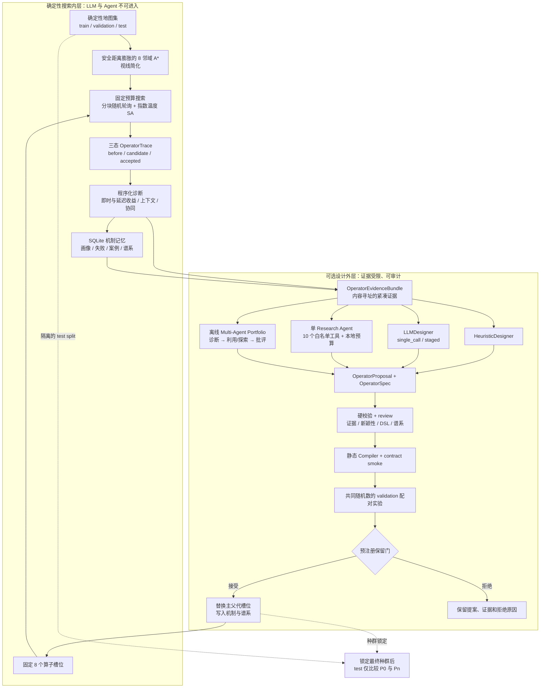
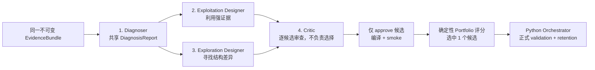

# Trajectory-Informed Operator Evolution

这是一个面向研究复现的无人机二维路径规划 MVP。项目不把“大模型直接规划路径”作为目标，而是研究一个更可检验的问题：**能否从搜索轨迹中识别算子的有效机制与失败模式，再据此设计、编译和验证新的路径算子？**

Phase 1–7 实现了环境生成、固定搜索、三态轨迹、条件化诊断、机制记忆、安全 DSL、两代算子演化、基线与图表；Phase 8 在不改变搜索内层和保留规则的前提下，增加结构化 EvidenceBundle、LLM Designer、受限 Agent、Provider、Prompt 版本和本地审计。离线 `multi_agent` 实验臂进一步将诊断、利用型设计、探索型设计和批评分成四个有界、顺序、可回放的角色调用。

项目的核心边界是：

- 默认 `designer_mode=heuristic`，保持原有离线行为，不需要 API key。
- `designer_mode=multi_agent` 是确定性离线对照臂，只允许 `provider=mock`；它不会隐式转换实验模式。
- LLM 或 Agent 只参与“候选算子设计”，不进入逐步路径搜索。
- 编译、安全门、固定预算配对验证和保留决定始终由确定性 Python 执行。
- Agent 的文字判断不能接受候选，测试集也不能参与候选保留。
- 核心流程单进程、CPU 可运行，不依赖 GPU、网络、SciPy、ROS、PX4 或 AirSim。

项目正在规划从 UAV 单领域实现演进为通用的 Trajectory-Informed Operator Evolution 架构。当前仓库继续作为第一个领域实现，通用协议、零行为变化门和 Job-Shop Scheduling 第二领域的分阶段方案见 [`docs/generalization_architecture.md`](docs/generalization_architecture.md)。

## 系统架构与数据流



一次完整实验的数据流如下：

1. 从主种子派生互不混用的地图、调度、算子、接受、反事实和 bootstrap 子种子。
2. 生成互不重叠的 train、validation、test 地图清单并保存内容哈希。
3. 使用固定 A* 初始路径、8 算子分块轮询和模拟退火执行训练搜索。
4. 每次算子调用写入一条完整三态轨迹；训练后计算 5、10、20 步延迟收益。
5. 诊断器生成全局与上下文画像、失败模式和连续算子协同；机制记忆保存证据来源。
6. Evidence Builder 将画像、记忆、代表案例和小规模反事实压缩为结构化证据包。
7. Heuristic、LLM、单 Agent 或离线 Multi-Agent Portfolio 生成数据型 OperatorProposal；任意代码文本都不会执行。
8. 静态校验、DSL 编译、契约 smoke 和 validation 配对实验依次推进候选状态。
9. 只有预注册保留门能够更新算子槽位；拒绝候选仍完整留档。
10. 种群锁定后才读取 test split，对 P0 和最终种群作一次最终比较。

## 环境、目标函数与固定搜索

环境包含地图边界、圆形或轴对齐矩形障碍物，以及带强度的风险区。生成器支持 `sparse`、`medium`、`dense`、`corridor`、`clustered`、`mixed` 六类地图；起终点保护、A* 连通性检查和有上限的确定性重试都在生成阶段完成。测试集使用更大的地图、更严格的安全距离和更极端的困难参数。

默认目标函数为：

```text
J(x) = 1.0 L(x) + 1000.0 C(x) + 5.0 S(x) + 10.0 R(x) + 0.5 N(x)
```

其中 `L` 是路径长度，`C` 是碰撞与安全距离惩罚，`S` 是转角平滑度，`R` 是风险暴露积分，`N` 是中间航路点数。`EvaluationResult` 同时保存总成本和全部原始分项。可行路径必须无碰撞、满足净空要求且所有坐标位于边界内。

初始人工种群包含八个算子：

- `waypoint_perturb`
- `segment_shift`
- `insert_waypoint`
- `delete_waypoint`
- `shortcut`
- `smooth_segment`
- `obstacle_detour`
- `partial_reconstruction`

调度采用分块随机轮询：每 8 次调用恰好覆盖 8 个槽位一次，块内顺序由稳定子种子随机化。所有实验臂共享相同初始路径、槽位调度、调用种子和迭代预算。

## 项目模块

| 模块 | 职责 |
| --- | --- |
| `operator_evolution_core/contracts/` | 实验性实例/评价模型与可组合 DomainAdapter 协议；不依赖 UAV 实现 |
| `domain/` | UAV 实例/评价纯转换及初始化、评价、特征、codec、guard、trace encoder 装配 |
| `environment/` | 连续几何、障碍物、风险区、六类地图、数据集清单与内容哈希 |
| `path/` | 路径模型、A* 初始化、视线简化、目标函数和状态特征 |
| `operators/` | 八个人工算子、有界 primitive、严格 OperatorSpec、Compiler 与 registry |
| `search/` | 分块轮询、模拟退火接受、当前/最佳状态和固定搜索执行器 |
| `trajectory/` | SQLite/JSONL 三态轨迹、延迟收益与 trace 查询 |
| `diagnosis/` | 全局/上下文画像、协同分析和小规模反事实评估 |
| `memory/` | MechanismMemory、画像、机制、失败、案例、洞察和谱系查询 |
| `agents/evidence.py` | EvidenceBundle 模型、稳定证据 ID、去重与紧凑案例 |
| `agents/providers.py` | Mock/OpenAI 结构化输出 Provider、重试、usage 和错误边界 |
| `agents/llm_designer.py` | 兼容旧接口的 single-call/staged LLM Designer |
| `agents/tools.py` | 单 Agent 的固定工具注册表、权限、预算和紧凑结果 |
| `agents/research_agent.py` | 离线 Mock 与可选 OpenAI Agents SDK 单 Agent backend |
| `agents/multi_agent.py` | 四角色离线 portfolio、两个兄弟候选、确定性批评与共享预算 |
| `agents/audit.py` | 追加式 Evidence、LLM、Agent、portfolio、角色、工具和候选状态审计 |
| `agents/orchestrator.py` | 设计、审查、编译、smoke、正式验证、记忆和审计的确定性编排 |
| `evolution/` | 固定预算候选验证、适应度、保留门与固定槽位代际管理 |
| `experiments/` | CLI 使用的地图、搜索、诊断、演化、证据、基线和汇总工作流 |
| `visualization/` | 路径、画像、协同、代际、配对和谱系图；matplotlib 使用 `Agg` 后端 |

## 安装

要求 Python 3.11 或更高版本；项目在 Python 3.12 上进行验收。建议使用隔离虚拟环境，避免全局环境中的无关依赖冲突。

```powershell
python -m venv .venv
.venv\Scripts\Activate.ps1
python -m pip install --upgrade pip
```

只安装核心运行依赖：

```powershell
python -m pip install -e .
```

安装开发与测试依赖：

```powershell
python -m pip install -e ".[dev]"
```

按需安装真实 LLM 或 Agents SDK；核心和 `dev` 安装不会引入这些 SDK：

```powershell
python -m pip install -e ".[dev,llm]"
python -m pip install -e ".[dev,agent]"
python -m pip install -e ".[dev,llm,agent]"
```

可选依赖范围为 `openai>=2.46,<3`、`google-genai>=2.13,<3` 和 `openai-agents>=0.18,<0.19`。离线 Mock 流程不需要网络或 API key。AFL-UAV 的三 Provider 安全生成、人工哈希批准、冻结与 Validation 命令见 [docs/afl_uav_frozen_planner.md](docs/afl_uav_frozen_planner.md)；不调用 API 的种群、精英档案和路径算子增强见 [docs/evolutionary_afl_uav.md](docs/evolutionary_afl_uav.md)。

## CLI

所有命令都接受 `--config`。创建实验的命令可指定 `--run-id` 或 `--run-dir`；读取型命令未显式给出目录时，通过 `artifacts/results/latest.json` 解析最近一次运行。结果数据库和报告写入 `artifacts/results/<run_id>/`，图写入 `artifacts/figures/<run_id>/`，不会覆盖旧实验。

### Phase 1–7 命令

```powershell
# 生成 train / validation / test 地图
python -m uav_operator_evolution.cli generate-maps --config configs/smoke.yaml

# 执行固定 P0 搜索并记录轨迹
python -m uav_operator_evolution.cli run-search --config configs/smoke.yaml

# 诊断已有运行；省略 --run-dir 时读取 latest.json
python -m uav_operator_evolution.cli diagnose --config configs/smoke.yaml --run-dir artifacts/results/<run_id>

# 执行配置中的代际演化
python -m uav_operator_evolution.cli evolve --config configs/smoke.yaml

# 完成离线地图、搜索、诊断、演化、测试和图表闭环
python -m uav_operator_evolution.cli demo --config configs/smoke.yaml

# 运行六类基线实验臂
python -m uav_operator_evolution.cli run-baselines --config configs/smoke.yaml

# 汇总已有运行
python -m uav_operator_evolution.cli summarize --config configs/smoke.yaml --run-dir artifacts/results/<run_id>
```

旧 YAML 不需要增加 `agent` 块；缺省值为 `designer_mode=heuristic`，因此原 `evolve` 与 `demo` 行为保持兼容。

### Phase 8 命令

`build-evidence` 从已有轨迹、画像和 MechanismMemory 构建并持久化证据包，输出 bundle hash、证据计数与规范化 JSON：

```powershell
python -m uav_operator_evolution.cli build-evidence `
  --config configs/agent_smoke.yaml `
  --run-dir artifacts/results/<run_id>
```

`propose-operator` 只生成并审查候选，不执行正式 validation。`single_call` 一次返回完整提案，`staged` 先诊断再设计：

```powershell
python -m uav_operator_evolution.cli propose-operator `
  --provider mock `
  --mode staged `
  --config configs/agent_smoke.yaml `
  --run-dir artifacts/results/<run_id>
```

`run-agent` 执行受限工具闭环、编译和 smoke，但 Agent 无权执行正式 validation。`--agent-mode` 显式选择单 Agent 或离线 Multi-Agent Portfolio：

```powershell
python -m uav_operator_evolution.cli run-agent `
  --provider mock `
  --agent-mode single_agent `
  --config configs/agent_smoke.yaml `
  --run-dir artifacts/results/<run_id>
```

多 Agent 模式使用独立的小预算配置：

```powershell
python -m uav_operator_evolution.cli run-agent `
  --provider mock `
  --agent-mode multi_agent `
  --config configs/multi_agent_smoke.yaml `
  --run-dir artifacts/results/<run_id>
```

`validate-candidate` 从审计数据库按 candidate ID 读取已生成提案，只在 validation split 上执行固定预算配对验证，并更新机制记忆：

```powershell
python -m uav_operator_evolution.cli validate-candidate `
  --candidate-id <candidate_id> `
  --config configs/agent_smoke.yaml `
  --run-dir artifacts/results/<run_id>
```

`agent-demo` 自动完成小规模 P0 搜索与诊断、父代选择、Mock Agent、编译、smoke、正式配对和机制记忆更新。候选通过保留门时写入父子谱系；候选被拒绝时保存 proposal、review、验证结果、拒绝原因和失败证据，不伪造成功谱系。它是 Phase 8 的默认离线验收命令：

```powershell
python -m uav_operator_evolution.cli agent-demo `
  --provider mock `
  --agent-mode single_agent `
  --config configs/agent_smoke.yaml
```

离线 Multi-Agent Portfolio 的完整验收使用同一 `agent-demo` 入口：

```powershell
python -m uav_operator_evolution.cli agent-demo `
  --provider mock `
  --agent-mode multi_agent `
  --config configs/multi_agent_smoke.yaml
```

`--agent-mode multi_agent` 与 `provider=openai` 是无效组合：CLI/配置校验会明确报错，不会静默回退到单 Agent、heuristic 或 Mock 的其他模式。

`run-agent-ablations` 比较 heuristic、总分 LLM、结构化诊断 LLM、诊断加 memory LLM 和单 Agent。各臂强制共享父代、地图、随机种子、候选数与验证预算，并汇总 token usage：

```powershell
python -m uav_operator_evolution.cli run-agent-ablations `
  --provider mock `
  --config configs/agent_smoke.yaml
```

## 三态轨迹、诊断与机制记忆

每次迭代恰好写入一条 `OperatorTrace`。关键字段包括：

- `before_state`：算子调用前的路径、目标分项和搜索特征。
- `candidate_state`：算子直接产生的候选路径及程序化评价。
- `accepted_state`：模拟退火接受或拒绝后，实际进入下一步的状态。
- `modified_indices`、内部状态、调用种子、失败原因、耗时和接受原因。
- 即时收益与 5、10、20 步延迟收益；尾部不足完整未来窗口时保存为 `null`，绝不跨 run 或 map 补窗。

`cost_after` 始终表示候选成本，接受后的实际搜索成本保存在 accepted state 中。这样，被拒绝候选的即时贡献不会与下一步携带状态混淆。

诊断器按地图类型、障碍密度、搜索阶段、停滞、调用前可行性、碰撞数和平滑度分组。样本不足时明确标记 `insufficient_evidence`。连续算子协同是相对于第二算子全局基线的关联性统计，不宣称因果；固定状态和种子的反事实比较与正式配对验证用于增强证据。

`MechanismMemory` 提供算子历史、最佳机制、失败模式、协同、相关案例和谱系查询。机制洞察保留 trace/profile 证据引用、置信度、适用上下文和失败上下文，不使用向量数据库。

## OperatorEvidenceBundle

Evidence Builder 只通过类型化诊断、记忆、单条 trace 查询、反事实评估与算子 registry 读取数据，不把整张轨迹表送给模型。所有集合稳定排序并语义去重；证据 ID 使用内容哈希前缀：

- 上下文：`ctx_<24 位哈希>`
- 失败：`fail_<24 位哈希>`
- 协同：`syn_<24 位哈希>`
- 反事实：`cf_<24 位哈希>`
- 案例：`case_<24 位哈希>`

证据项的公共字段为 `evidence_id`、`source_refs`、`sample_count`、`effect_size`、`confidence` 和 `low_confidence`。证据包包含：

- `bundle_version`、`bundle_hash` 和 `problem_summary`
- `parent_specs`、`parent_profiles`
- `effective_contexts`、`failure_contexts`、`failure_modes`
- `synergy_evidence`、`counterfactual_evidence`
- `representative_success_cases`、`representative_failure_cases`
- `existing_operator_names`、`allowed_primitives`
- `design_budget` 和 `limitations`

代表案例只含成本、可行性、收益、上下文标签、接受结果、错误和耗时等标量摘要；**不会包含完整路径、地图几何或原始搜索状态**。案例或反事实缺失时返回空数组，并在 `limitations` 记录缺口，不生成虚假证据。

默认设计证据预算为：

| 项目 | 上限 |
| --- | ---: |
| 父代规格 | 4 |
| 有效上下文 | 8 |
| 失败上下文/失败证据 | 各 8 |
| 协同证据 | 8 |
| 反事实证据 | 8 |
| 成功代表案例 | 3 |
| 失败代表案例 | 3 |
| 规范化 JSON 字符数 | 60,000 |
| 一次设计的最终候选 | 1 |

`bundle_hash` 对排除自身 hash 的规范化 JSON 使用 SHA-256，时间戳不参与内容哈希，因此同一输入证据可稳定回放。

## LLM Designer、单 Agent 与离线 Multi-Agent Portfolio

| 模式 | 过程 | 可调用工具 | 是否自行正式验证 |
| --- | --- | --- | --- |
| `heuristic` | 由画像、失败和协同规则确定性构造提案 | 无 | 否 |
| `llm_single_call` | 一次 Structured Output 返回完整 OperatorProposal | 无 | 否 |
| `llm_staged` | 先生成 DiagnosisReport，再基于同一诊断生成提案 | 无 | 否 |
| `single_agent` | 在本地预算内查询证据、编译、smoke，失败时最多修订一次 | 固定白名单 | 否 |
| `multi_agent` | 四个顺序 Mock 角色共享证据与总预算，产生两个兄弟候选后确定性选一 | 固定白名单 | 否 |

staged 模式要求提案中携带的 diagnosis 与第一阶段诊断内容 hash 完全一致。所有 claim、hypothesis 与 proposal 引用的 evidence ID 必须存在于同一 bundle；模型不能通过文字覆盖硬校验。

单 Agent 是研究候选生成器，不是实验控制器。实验 Orchestrator 仍是普通 Python，负责构建证据、启动设计、静态审查、正式配对、保留决策、记忆写入和审计闭环。

### 离线 Multi-Agent 拓扑

`multi_agent` 不是自由对话或自治群体，而是固定顺序的候选 portfolio：



四个角色共享同一 bundle、工具 dispatcher、调用预算和审计 run。两个 Designer 的输出是并列兄弟候选，不是修订链；因此 smoke 配置明确设置 `max_revisions=0`。Critic 只逐候选给出 `approve/revise/reject` 和证据、安全、可测试性评分，不能修改规格或选择胜者；只有 `approve` 候选才会编译和 smoke。角色顺序、候选 ID 和平局打破规则都是稳定的，所以 Mock 运行可严格回放。

实现中的公开角色分别是 `ExploitationDesigner`、`ExplorationDesigner` 和无选择方法的 `DeterministicCritic`，由 `MultiAgentCoordinator` 顺序调度，`DeterministicMockMultiAgent` 提供离线装配。角色级 Provider、schema 或 token 失败会 fail-closed：两个兄弟槽位都进入 `REJECTED`，已发生的调用和部分角色轨迹仍写入 failed multi-agent audit run；失败发生在 Portfolio 建立前时不会伪造 Portfolio。配置也会在启动前验证双候选、四轮、十二工具调用、两次 smoke 和零修订所需的最低预算。

Python Coordinator 使用固定评分：`0.30 evidence_alignment + 0.20 safety + 0.20 topology_diversity + 0.15 priority_failure_coverage + 0.15 testability`。Critic 与静态审查的同名分项取较小值；重复拓扑最多保留一个，完全同分时按 exploitation、exploration、candidate ID 的顺序决胜。该分数只负责正式验证前的 portfolio 预筛，不替代配对验证或 retention。

该模式只是一条离线消融臂：不启用 Agents SDK handoff、不并发角色、不访问网络，也不支持 `provider=openai`。这个边界避免将远程模型漂移与“单 Agent 对 portfolio”的结构差异混在同一对照中。

### Agent 工具白名单

工具注册表恰好包含以下 10 项：

1. `get_operator_profile`
2. `get_failure_modes`
3. `get_synergies`
4. `get_relevant_cases`
5. `get_lineage`
6. `get_counterfactual_results`
7. `get_allowed_primitives`
8. `get_parent_operator_spec`
9. `compile_operator_spec`
10. `run_operator_smoke_test`

每项工具都有严格 Pydantic 输入、长度受限的紧凑 JSON 输出、授权检查、前后预算检查和本地审计。smoke 只做契约与少量路径调用，不是正式实验。白名单中没有 shell、文件、网络、Hosted Tool、任意 Python、handoff 或正式 validation 能力；Agent 也拿不到 test split。

Multi-Agent Portfolio 不会为每个角色复制工具预算。它先共享 8 次只读证据查询，再为两个兄弟候选各执行一次编译和一次 smoke，共 12 次工具调用。任一角色都无法获得正式 validation 工具。

### 设计与调用预算

LLM 调用默认限制：

- 单阶段超时 60 秒。
- 最多重试 2 次。
- 单次最多 4,096 输出 token。
- 一次设计累计最多 20,000 token。

单 Agent 默认限制：

- `max_turns=6`
- `max_tool_calls=12`
- `max_candidate_specs=2`，包含初稿与修正版
- `max_revisions=1`
- `max_smoke_tests=2`

编译、静态审查或 smoke 失败时最多修订一次。原候选立即标记 `REJECTED`，修正版获得新的 candidate ID，并通过 `supersedes_candidate_id` 保留修订关系。SDK 自带限制不能替代这些本地硬预算。

`configs/multi_agent_smoke.yaml` 为四角色 portfolio 预注册一个**全局共享**预算，不是每个角色各自拥有一份：

- `max_turns=4`：诊断、利用设计、探索设计和批评各一次结构化调用。
- `max_tool_calls=12`：8 次共享证据查询，加两个候选各自的 compile/smoke。
- `max_candidate_specs=2`：一个 exploitation 与一个 exploration 兄弟候选。
- `max_revisions=0`：不把其中一个候选解释为另一个的修订。
- `max_smoke_tests=2`：每个候选最多一次 smoke。

`design_budget.max_candidate_specs` 同样设为 2；`llm_call.max_total_tokens=20000` 是四个角色共享的累计上限。任一总预算耗尽都立即 fail closed，不会为后续角色重置计数器。

## Provider、Prompt 与真实 OpenAI 接入

`MockLLMProvider` 是离线测试、`agent-demo` 和可重复消融的默认 Provider。它按输出模型生成确定性 fixture，并可模拟 schema error、refusal、timeout、rate limit 和 server error；同样经过 Pydantic、证据交叉验证和审计。

`multi_agent` 目前是专门的离线 Mock 实验臂。`AgentConfig` 对 `designer_mode=multi_agent, provider=openai` 直接返回配置错误；即使已安装 OpenAI 或 Agents SDK，也不改变这一约束。真实 Provider 实验仍使用 `llm_single_call`、`llm_staged` 或已有的 `single_agent` 模式。

`OpenAIProvider` 延迟导入 SDK，使用 Responses API 的 Structured Outputs：`client.responses.parse(..., text_format=PydanticModel)`。启用真实接口前必须显式设置：

```powershell
$env:OPENAI_API_KEY = "..."       # 或 UOE_LLM_API_KEY
$env:UOE_LLM_MODEL = "<model-id>"
```

然后明确选择 `--provider openai` 或在 YAML 中设置 `agent.provider: openai`。Phase 8 的显式 OpenAI 实验臂在缺少 key、model、SDK、有效 parsed output 或遭遇 refusal 时会清晰失败，**不会静默切换到 heuristic 或 mock**，以免污染消融结果。只有原有的兼容式六参数 `LLMDesignerAdapter.propose()` 在未配置客户端时保留历史 heuristic fallback 行为。

参考官方文档：

- [OpenAI Structured Outputs](https://developers.openai.com/api/docs/guides/structured-outputs)
- [OpenAI Agents SDK：Agent、输出类型与工具](https://openai.github.io/openai-agents-python/agents/)
- [OpenAI Agents SDK：Tracing](https://openai.github.io/openai-agents-python/tracing/)
- [OpenAI Agents SDK：Usage](https://openai.github.io/openai-agents-python/usage/)
- [OpenAI Agents SDK：运行与 max turns](https://openai.github.io/openai-agents-python/running_agents/)

Prompt 被视为实验配置。单 Agent/Designer 的四个不可变模板为：

- `diagnoser_v1`
- `designer_v1`
- `reviewer_v1`
- `research_agent_v1`

Multi-Agent Portfolio 额外使用三个角色模板（诊断角色复用 `diagnoser_v1`）：

- `designer_exploitation_v1`
- `designer_exploration_v1`
- `critic_v1`

每次调用保存 prompt version 和内容 SHA-256；模板文本修改应创建新版本，不应原地覆盖旧版本。

## 提案硬校验、安全 DSL 与编译

`ProposalValidator` 在任何评分审查之前执行以下不可跳过的检查：

- diagnosis、hypothesis 和 proposal 的 evidence ID 全部存在于 bundle。
- `target_failure_mode` 与诊断中的失败 claim 完全匹配，并引用该 claim 的至少一个证据 ID。
- 父代存在于 bundle，所有 primitive 来自公开 DSL catalog。
- 只修改名称、描述或元数据的 rename-only 提案直接拒绝。
- 只改参数的候选可进入验证，但 `novelty_score <= 0.35`，谱系标为 `parameter_variant`。
- 结构变化根据条件、选择器、变换顺序、repair 和 fallback 生成 topology fingerprint，谱系标为 `structural_variant`。
- rule-based review 的 evidence alignment、safety、testability 阈值分别为 `0.60`、`0.80`、`0.60`。

`review_mode=none` 只跳过评分审查，不能跳过 schema、证据、primitive、父代、rename-only 或编译硬校验。

一个合法 DSL 示例：

```json
{
  "name": "DetourThenSmooth",
  "description": "先修复碰撞段，再对绕行点执行有界平滑。",
  "parent_operators": ["obstacle_detour", "smooth_segment"],
  "applicability_conditions": [
    {"feature": "collision_count", "operator": "gt", "value": 0}
  ],
  "selection_strategy": {"kind": "select_collision_segment"},
  "transformations": [
    {
      "kind": "generate_obstacle_detour",
      "clearance_factor": 1.5,
      "repeat": 1
    },
    {
      "kind": "smooth_segment",
      "strength": 0.55,
      "repeat": 1
    }
  ],
  "repair_strategy": {
    "kind": "repeat_until_feasible",
    "transformations": [
      {"kind": "reconstruct_segment", "max_points": 8, "repeat": 1}
    ],
    "max_attempts": 2
  },
  "fallback_strategy": {"kind": "rollback_on_failure"},
  "parameters": {"generation": 1},
  "expected_mechanism": "绕障后降低局部高曲率，同时在失败时回滚。",
  "target_failure_modes": ["collision", "jagged_detour"]
}
```

所有 DSL 模型均 `extra="forbid"`，拒绝未知 primitive、NaN/Inf 和越界参数。默认上限为 8 个条件、8 个变换、单步重复 3 次、4 个父代、128 个航路点、单次新增 16 点和 100 ms 协作式 deadline。

Compiler 只通过静态 registry 解释白名单 primitive；每一步检查 deadline、有限坐标、端点和航路点数量，异常时回滚。它不使用 `eval`、`exec`、动态导入或任意代码执行。该 deadline 是可信有界 primitive 的协作式限制，不是运行不可信 Python 的操作系统沙箱。

## 候选状态机与保留规则

候选只能按以下顺序推进：

```text
PROPOSED → SCHEMA_VALID → REVIEWED → COMPILED
→ SMOKE_PASSED → VALIDATED → ACCEPTED / REJECTED
```

任意中间阶段都可以终止为 `REJECTED`，但终止状态之后不能继续转换。每次转换都记录前一状态、原因、bundle、Agent run 和细节。

正式验证由 `FixedBudgetCandidateValidator` 执行：候选只替换主父代所在槽位，父子两臂在相同 validation 地图、初始路径、调度、种子和调用预算下比较。每张地图默认执行 4 次无 recorder 的确定性 ABBA 计时（parent-first、candidate-first、candidate-first、parent-first），以各臂总搜索耗时的中位数进入 runtime gate；另行回放一对轨迹用于审计，因此 SQLite I/O 不会污染计时。Agent 不能调用这一层。

每个配对结果同时保存父子两臂的总耗时样本、目标算子纯 `apply()` 耗时、目标算子调用数、实际改路数和接受数。运行时只是总搜索效果指标，算子级耗时用于解释速度来源。候选的 `candidate_effective_call_rate` 定义为“实际改变候选路径的调用数 / 候选算子调用数”；默认至少为 10% 才允许仅凭运行时间保留。完全 no-op 或从未被调度的候选即使看起来更快，也会以 `runtime evidence ineligible` 拒绝。

Smoke 配置使用探索性保留门，满足以下任一实际效应才可能保留：

- 全局成本至少改善 2%。
- 困难场景至少改善 5%。
- 可行率提高至少 10 个百分点。
- 运行时降低至少 25%，成本退化不超过 1%，且候选实际改路率达到预注册下限。

默认大配置还要求固定种子 paired bootstrap 95% CI 支持改善。代内适应度只用于排序，不替代安全门和保留门。劣质候选不会为了演示而强制接受。

test split 从不传给设计 Orchestrator 或保留函数。只有 Pn 锁定后才进行 P0/Pn 最终测试；因此测试结果不会反向改变候选、记忆或谱系。

## 本地审计与回放

Phase 8 在同一个 `experiment.sqlite` 中追加九张独立审计表，不修改原有轨迹和机制记忆表：

- `evidence_bundles`：规范化 bundle JSON、hash、run 和 candidate 关联。
- `llm_calls`：provider、model、prompt version/hash、response、usage、重试、延迟和错误。
- `agent_runs`：模式、本地预算、usage、本地 trace ID、可选 SDK trace ID 和终态。
- `agent_tool_calls`：调用序号、授权、参数/结果摘要、延迟和状态。
- `candidate_events`：受 SQLite trigger 约束的候选状态转换。
- `agent_schema_meta`：审计 schema 版本。
- `multi_agent_runs`：协调器版本、共享预算/usage、bundle/portfolio hash、选中候选与理由。
- `candidate_portfolios`：两个兄弟候选、批评和选择的规范化 portfolio JSON。
- `multi_agent_role_events`：四个角色的顺序、动作、candidate ID、prompt/call/hash、token、耗时和终态。

远程 tracing 默认关闭：

```yaml
agent:
  remote_tracing: false
  trace_include_sensitive_data: false
```

本地审计不依赖远程 tracing。即使显式开启 SDK tracing，也默认不包含敏感数据，API key 和敏感环境变量不会写入数据库；本地 agent run ID 与 SDK trace ID 分开保存。

可以使用系统的 `sqlite3` 客户端直接检查审计链：

```sql
-- 证据包及其内容哈希
SELECT bundle_id, experiment_id, bundle_hash, length(bundle_json) AS chars
FROM evidence_bundles
ORDER BY created_at DESC;

-- Agent 预算、usage 和本地/远程 trace 关联
SELECT agent_run_id, provider, mode, status,
       json_extract(usage_json, '$.tokens') AS tokens,
       local_trace_id, sdk_trace_id
FROM agent_runs
ORDER BY started_at DESC;

-- Prompt 版本、hash、token 与重试
SELECT call_id, agent_run_id, model, prompt_version,
       substr(prompt_hash, 1, 12) AS prompt_hash_prefix,
       json_extract(usage_json, '$.total_tokens') AS total_tokens,
       retries, status, error
FROM llm_calls
ORDER BY created_at;

-- 工具授权与执行顺序
SELECT agent_run_id, sequence, tool_name, authorization, status, latency_ms
FROM agent_tool_calls
ORDER BY agent_run_id, sequence;

-- 候选完整状态机
SELECT candidate_id, sequence, previous_status, status, reason
FROM candidate_events
ORDER BY candidate_id, sequence;

-- Multi-Agent 共享预算、portfolio 与选择
SELECT multi_agent_run_id, agent_run_id, coordinator_version,
       portfolio_hash, selected_candidate_id, selection_reason, status
FROM multi_agent_runs
ORDER BY started_at DESC;

-- 四个角色的可回放调用链
SELECT multi_agent_run_id, sequence, agent_role, action, candidate_id,
       prompt_version, substr(prompt_hash, 1, 12) AS prompt_hash_prefix,
       provider_call_id, tokens, status
FROM multi_agent_role_events
ORDER BY multi_agent_run_id, sequence;

-- 接受候选的父子谱系
SELECT parent_id, child_id, relation, created_at
FROM lineage
ORDER BY lineage_id;
```

`bundle_json`、prompt/version/hash、LLM usage、工具摘要、portfolio、角色事件、候选状态、验证报告和谱系共同构成可回放的本地证据链。Multi-Agent 角色事件可关联到对应 `llm_calls.call_id`，但仍只有外层 Python Orchestrator 能写入正式 validation 和 retention 结果。

## 配置

旧配置仍可直接加载；`ExperimentConfig.agent` 有完整默认值。Phase 8 常用配置如下：

```yaml
evolution:
  min_runtime_reduction: 0.25
  runtime_validation_repetitions: 4  # 偶数；使用平衡 ABBA 顺序
  min_runtime_effective_call_rate: 0.10

agent:
  designer_mode: single_agent   # heuristic | llm_single_call | llm_staged | single_agent | multi_agent
  provider: mock                # mock | openai
  memory_mode: mechanism_and_lineage
  feedback_mode: diagnosis
  review_mode: rule_based       # none | rule_based | llm
  remote_tracing: false
  trace_include_sensitive_data: false
  design_budget:
    max_parent_specs: 4
    max_context_evidence: 8
    max_failure_evidence: 8
    max_synergy_evidence: 8
    max_counterfactual_evidence: 8
    max_success_cases: 3
    max_failure_cases: 3
    max_bundle_chars: 60000
    max_candidate_specs: 1
  llm_call:
    timeout_seconds: 60
    max_retries: 2
    max_output_tokens: 4096
    max_total_tokens: 20000
  agent_budget:
    max_turns: 6
    max_tool_calls: 12
    max_candidate_specs: 2
    max_revisions: 1
    max_smoke_tests: 2
```

`configs/agent_smoke.yaml` 使用 2 张训练图、2 张验证图、1 张测试图和 16/12/12 次调用，默认 Mock 单 Agent，适合约 30 秒以内的离线验收。

`configs/multi_agent_smoke.yaml` 使用相同的小地图与搜索预算，但将候选预算明确分配给离线 portfolio：

```yaml
agent:
  designer_mode: multi_agent
  provider: mock
  memory_mode: mechanism_and_lineage
  feedback_mode: diagnosis
  review_mode: rule_based
  remote_tracing: false
  trace_include_sensitive_data: false
  design_budget:
    max_parent_specs: 4
    max_context_evidence: 8
    max_failure_evidence: 8
    max_synergy_evidence: 8
    max_counterfactual_evidence: 8
    max_success_cases: 3
    max_failure_cases: 3
    max_bundle_chars: 60000
    max_candidate_specs: 2
  llm_call:
    timeout_seconds: 60
    max_retries: 2
    max_output_tokens: 4096
    max_total_tokens: 20000
  agent_budget:
    max_turns: 4
    max_tool_calls: 12
    max_candidate_specs: 2
    max_revisions: 0
    max_smoke_tests: 2
```

`multi_agent` 不增加新的预算 schema，而是复用 `design_budget`、`llm_call` 和 `agent_budget`。因此旧 YAML 不受影响，而且对照臂可以用同一套预算字段做显式比较。

## 扩展算子与地图

新增人工算子时：

1. 在 `operators/manual.py` 实现统一 `PathOperator` 协议。
2. 优先复用 `operators/primitives.py` 中的有界纯函数。
3. 在 `operators/registry.py` 以固定顺序注册实现。
4. 在 `operators/catalog.py` 添加等价的 OperatorSpec 数据描述。
5. 增加输入不可变、端点保持、有限坐标、短路径、异常回滚和同种子确定性测试。

新增 DSL primitive 时还必须同步更新 `operators/specs.py` 中的 discriminated union 和公开只读 catalog，并在 Compiler 的静态 registry 中实现；Evidence Builder 和 Agent 会从同一 catalog 读取白名单，避免出现两套漂移的权限定义。

新增地图类型时：

1. 扩展 `environment/environment.py` 的 difficulty 类型。
2. 在 `environment/generator.py` 增加使用显式 RNG 的确定性生成分支。
3. 保证起终点安全、A* 连通、有上限重试和内容 hash 稳定。
4. 增加同种子重现、不同 split 不重叠和 JSON round-trip 测试。

## 可复现性

项目不使用 Python `hash()` 或全局随机状态。`stable_hash` 对规范化 JSON 使用 SHA-256，`derive_seed` 用主种子和语义标签派生独立随机流。实验记录配置 hash、地图内容 hash、主/子种子、依赖版本、运行元数据、Prompt hash 和 EvidenceBundle hash。

复现实验应保存：

- 原始 YAML 配置和配置 hash。
- `data/.../manifest.json` 及地图 JSON。
- `artifacts/results/<run_id>/experiment.sqlite`。
- JSON/CSV 汇总、可选 JSONL 轨迹和图表目录。
- Provider/model、Prompt version/hash、bundle hash 和所有审计记录。

同一配置和种子应产生相同地图、调度、算子随机调用、接受决策、反事实采样和 bootstrap 流。墙钟时间、数据库时间戳和真实远程模型输出不要求逐位一致；需要严格可重复的 LLM/Agent 消融时应使用 Mock Provider。

## AFL 论文工作流的 UAV 独立复现

项目新增 `afl-uav-demo`，将 AFL 的问题描述、阶段化代码生成、判断/修订、错误分析和
解答验证闭环迁移到静态二维无人机路径规划。Mock 模式可离线完成端到端复现：

```powershell
python -m uav_operator_evolution.cli afl-uav-demo `
  --provider mock `
  --config configs/agent_smoke.yaml `
  --run-id afl-uav-smoke
```

真实模型模式默认只生成、不执行代码；`--execute-untrusted-code` 是显式执行开关，现有 AST
规则和子进程限制不是操作系统级沙箱。详细的论文概念映射、独立复现边界、缓存规则和产物说明
见 [`docs/afl_uav_reproduction.md`](docs/afl_uav_reproduction.md)。

## 测试与验收

运行全部离线测试：

```powershell
python -m pytest
```

通用化第一阶段的 UAV 行为身份回归门：

```powershell
python -m pytest tests/test_uav_phase1_characterization.py
```

该回归门固定配置与数据清单 hash、八算子搜索顺序、三态轨迹、候选提案、验证结果和最终种群；时间戳与墙钟运行时间不进入行为身份。

Step 1 的通用契约与 UAV 纯适配器回归门：

```powershell
python -m pytest tests/test_core_contracts.py tests/test_uav_contract_adapters.py
```

`InstanceRef` 只保存可稳定比较的实例身份，不复制完整地图；`ObjectiveEvaluation` 统一采用“有限标量成本、越小越好”的语义。二者目前均为实验性内部 API。

Step 2 的完整 UAV `DomainAdapter` characterization 门：

```powershell
python -m pytest tests/test_uav_domain_adapter.py tests/test_uav_phase1_characterization.py
```

该 adapter 将初始化、评价、特征、路径复制/规范化、结构校验和 trace snapshot 拆成六个小组件。当前搜索与 recorder 尚未改用它；这条切换及新旧 shadow comparison 属于 Step 3–4。

Phase 1–7 完整 smoke：

```powershell
python -m uav_operator_evolution.cli demo --config configs/smoke.yaml
```

Phase 8 无 API key 离线验收：

```powershell
python -m uav_operator_evolution.cli agent-demo `
  --provider mock `
  --agent-mode single_agent `
  --config configs/agent_smoke.yaml
```

离线 Multi-Agent Portfolio 验收（无 API key）：

```powershell
python -m uav_operator_evolution.cli agent-demo `
  --provider mock `
  --agent-mode multi_agent `
  --config configs/multi_agent_smoke.yaml
```

该命令的验收标准是：四个角色事件按固定顺序落库，产生两个兄弟候选，两者均留下 compile/smoke 证据，portfolio 仅选中一个交给正式 validation，且审计中没有 Agent 发起的 validation 工具调用。最终候选仍可因保留门未满足而被拒绝；离线 demo 不会伪造接受结果。

可选真实接口测试默认由 `live` marker 跳过。配置好凭据后运行：

```powershell
python -m pip install -e ".[dev,llm,agent]"
python -m pytest -m live
```

## 当前限制与 Multi-Agent 边界

- 环境是二维、静态、运动学级别；没有三维地形、动力学、移动障碍或真实飞控接口。
- 绕障和局部重建是轻量几何启发式，在复杂拓扑中可能安全 no-op。
- 画像、延迟收益和连续算子协同仍是关联证据；即使有反事实探针，也不能自动宣称因果。
- Smoke 的小样本效应阈值只支持探索性结论；正式研究需要预注册、更大样本和跨分布验证。
- DSL deadline 是协作式时间界限，不是承载第三方不可信代码的系统级沙箱。
- 真实 LLM 可能受服务端更新、采样和限流影响；模型生成的解释不是保留证据。
- 离线 Multi-Agent Portfolio 是四个顺序 Mock 角色，不是通用自治系统；它没有 handoff、自由对话、并发协商、私有长期记忆或自选工具的能力。
- exploitation 与 exploration 标签是可测试的设计偏好，不代表已证明的因果机制；Critic 的审查也不是保留决策。
- 当前 `multi_agent` 只支持 Mock Provider。因此它能检验 portfolio 、权限、预算和审计拓扑，但不能直接推断真实多模型协作的质量或成本。

因此，项目仍保持“确定性 Python Orchestrator 控制实验”的边界：单 Agent 和 Multi-Agent Portfolio 都只能提供结构化候选。当前的四角色拓扑使用固定顺序、共享总预算和完整本地审计，用来隔离“并列设计”带来的影响。如果未来引入真实远程多 Agent，应单独预注册角色级 token/工具预算、失败政策、对照臂和归因方法，而不应直接放宽现有安全边界。
