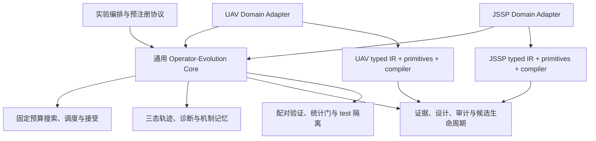

# 从 UAV 算子演化到通用算子演化内核

状态：已接受，按阶段实施  
日期：2026-08-20  
当前 UAV 基线提交：`0f74f21`  
目标研究名称：Trajectory-Informed Operator Evolution

## 1. 决策

保留 `UAV-Operator-Evolution` 作为第一个完整领域实现，不在第一阶段拆分仓库，也不立即重写现有搜索流程。先在当前仓库内定义通用协议，并让现有 UAV 实现通过兼容适配层满足这些协议；所有现有 CLI、实验配置、随机流、轨迹、验证决定和研究结果必须保持不变。

第二阶段引入结构明显不同的 Job-Shop Scheduling（JSSP）领域，检验同一套搜索、轨迹、诊断、证据、候选生命周期和固定预算验证协议是否能够复用。JSSP 首版只验证架构通用性，不开展跨领域知识迁移。

只有当 UAV 与 JSSP 两个适配器均通过共同契约后，才把已被两个领域验证的模块提取为独立的通用核心仓库。提取前的核心 API 视为实验性 `0.x` 接口，不承诺稳定。

## 2. 研究主张

本项目希望检验的通用命题是：

> 能否从受控搜索产生的轨迹中识别算子的有效机制与失败模式，并据此设计、编译和验证新的搜索算子，同时保持固定预算、可复现、安全门和测试集隔离？

无人机路径规划是连续几何领域的实例，JSSP 是离散排列与资源约束领域的实例。若同一内核能在两者上工作，才有证据支持架构层面的通用性。

阶段一和阶段二不主张：

- 某个领域的算子代码可以直接迁移到另一个领域。
- 轨迹关联、延迟收益或连续算子协同已经构成因果证明。
- 单一 DSL 能表达所有优化领域。
- 当前标量成本与单目标接受策略已经覆盖多目标优化。
- LLM 或 Agent 的文字判断可以代替确定性保留门。

## 3. 必须保持的系统不变量

以下约束属于通用架构，而不是 UAV 的偶然实现：

1. 搜索预算、调度、接受策略和候选保留规则由确定性代码控制。
2. 算子只能提出候选解，不能直接修改搜索器持有的当前解。
3. 每次算子调用都保留 before、candidate、accepted 三态。
4. 正奖励统一表示标量成本下降；核心内部始终采用“越小越好”的规范化成本。
5. 候选必须依次经过结构校验、编译、契约 smoke 和固定预算 validation。
6. validation 使用共同随机数或领域等价的配对设计；test 不能参与保留。
7. 原始实例、解、评价、随机种子、证据、候选谱系和决定均可序列化与审计。
8. Provider、单 Agent 或 Multi-Agent 只能生成结构化提案，不拥有正式验证或保留权限。
9. 领域适配器不得绕过计量评价器、随机流派生或可信最终评价。
10. 通用化不能改变现有 UAV 实验的语义身份。

## 4. 当前代码的真实边界

当前实现不是简单的“全部 UAV 专属”。部分模块已经使用 JSON 原生状态和协议接口，接近通用内核；另一些模块同时包含通用算法与路径语义，需要先建立接缝。

| 当前模块 | 当前判断 | 说明与目标归属 |
| --- | --- | --- |
| `reproducibility.py` | 通用候选 | 规范 JSON、稳定哈希、语义子种子可直接进入核心。 |
| `trajectory/models.py`、`recorder.py` | 基本通用 | `OperatorTrace` 已使用 JSON 三态；只需把 `map_id` 提升为兼容的 `instance_id`。 |
| `diagnosis/` | 基本通用 | 画像、延迟收益、上下文分组和顺序协同主要依赖 trace；反事实执行仍需适配器。 |
| `memory/` | 基本通用 | 机制、失败、案例与谱系模型可进入核心，但记录中的地图/路径命名需兼容迁移。 |
| `agents/providers.py`、`agents/audit.py` | 通用候选 | Provider、调用预算、错误边界和追加式审计与领域无关。 |
| `agents/evidence.py` | 混合 | 证据结构通用，但直接依赖 UAV `OperatorSpec`、registry 和 primitive catalog。 |
| `agents/designer_base.py`、`proposal_validation.py` | 混合 | 候选生命周期通用；提案与拓扑指纹依赖 UAV DSL。 |
| `search/acceptance.py` | 通用候选 | 标量最小化的模拟退火可复用；未来多目标策略不在本阶段范围。 |
| `search/scheduler.py` | 近似通用 | 分块轮询算法通用，但类型签名绑定 `PathOperator`。 |
| `search/context.py` | 混合 | 停滞、接受率和迭代进度通用，但评价类型绑定路径评价。 |
| `search/executor.py` | 主要抽象接缝 | 搜索循环通用；复制、初始化、清洗、评价、特征与 trace snapshot 全部绑定 UAV。 |
| `evolution/validation.py` | 混合 | 配对统计与保留门通用；字段仍使用 map、path 和 UAV 契约。 |
| `evolution/candidate_validator.py` | 主要抽象接缝 | CRN/ABBA 思路通用；初始化、实例、搜索执行和契约 smoke 绑定 UAV。 |
| `evolution/manager.py` | 混合编排 | 生命周期通用，但直接构造 UAV evaluator、compiler、operators 和 datasets。 |
| `operators/specs.py`、`compiler.py` | UAV Domain Kit | 路径选择、航路点变换、绕障和修复不能进入通用 primitive 集。 |
| `environment/`、`path/` | UAV Adapter | 实例、几何、解、初始化、评价与领域特征全部属于 UAV。 |
| `visualization/paths.py` | UAV Adapter | 路径绘制属于领域可视化。诊断统计图可以独立进入核心。 |
| `planning_benchmarks/` | 需要拆分 | 预算、可信验证和 runner 模式通用；碰撞检查、path hash 与 planner 接口属于 UAV。 |
| `afl_uav/` | UAV 应用层 | 完整求解器生成与冻结流程保留在 UAV 仓库，不作为通用核心前置条件。 |

因此，第一阶段的重点不是移动目录，而是为四个主要接缝建立协议：评价、领域适配、搜索算子和候选验证。

## 5. 目标架构



目标代码边界如下。阶段一只逐步建立这些边界，不要求一次完成物理迁移。

```text
src/
├─ operator_evolution_core/          # 阶段一的实验性通用命名空间
│  ├─ contracts/                     # 评价、算子、适配器、实例引用
│  ├─ search/                        # 调度、接受、执行与预算
│  ├─ trajectory/                    # 三态 trace、持久化与延迟收益
│  ├─ diagnosis/                     # 画像、上下文、协同与反事实协议
│  ├─ memory/                        # 机制、失败、案例与谱系
│  ├─ design/                        # 证据包、提案生命周期与审计
│  ├─ validation/                    # 契约、配对比较与保留门
│  └─ reproducibility/               # 哈希、随机流与运行身份
│
└─ uav_operator_evolution/
   ├─ domain/                        # UAV adapter 与 trace encoder
   ├─ environment/
   ├─ path/
   ├─ operators/                     # UAV typed IR、primitive、compiler
   ├─ visualization/
   └─ afl_uav/
```

旧导入路径在阶段一继续有效。若某个通用模块迁入实验性命名空间，原模块保留薄兼容 facade，直到独立核心仓库发布并完成一次明确的迁移版本。

## 6. 最小通用数据模型

### 6.1 InstanceRef

核心只保存实例身份，不解释实例内容。

```python
class InstanceRef(BaseModel):
    domain_id: str
    instance_id: str
    split: Literal["train", "validation", "test"]
    difficulty: str | None = None
    content_hash: str
    metadata: dict[str, JsonValue] = Field(default_factory=dict)
```

`map_id` 在 UAV trace 中继续保留，通用读取层将其映射为 `instance_id`。第一阶段不修改现有 SQLite schema 或历史 JSONL。

### 6.2 ObjectiveEvaluation

核心不认识碰撞、平滑度或 makespan，只认识一个标量成本、分解项和约束状态。

```python
class ObjectiveEvaluation(BaseModel):
    scalar_cost: float                 # 有限值，越小越好
    components: dict[str, float]
    feasible: bool
    violations: dict[str, float]
    metadata: dict[str, JsonValue] = Field(default_factory=dict)
```

UAV `EvaluationResult.total_cost` 映射到 `scalar_cost`；路径长度、碰撞、平滑度、风险和航路点惩罚映射到 `components`。JSSP 首版把 makespan 映射到 `scalar_cost`。

核心暂不支持 Pareto 排序。未来多目标领域必须先通过领域策略明确投影为标量成本，或在新的 acceptance/retention 协议中显式增加多目标语义。

### 6.3 SearchContext

通用上下文保留当前已经存在的搜索状态，并允许领域提供只读特征：

```python
class SearchContext(BaseModel):
    iteration: int
    max_iterations: int
    current_evaluation: ObjectiveEvaluation
    best_evaluation: ObjectiveEvaluation
    stagnation_count: int
    recent_improvements: tuple[float, ...]
    recent_acceptances: tuple[bool, ...]
    last_created_new_best: bool
    domain_features: dict[str, JsonValue]
```

`iteration_ratio`、`best_cost_gap`、近期改进率与近期接受率继续由核心计算。障碍密度、最小净空、关键路径长度和机器负载不均衡属于 `domain_features`。

### 6.4 OperatorOutcome

```python
class OperatorOutcome(Generic[SolutionT]):
    solution: SolutionT
    changed_items: tuple[str | int, ...]
    success: bool
    metadata: dict[str, JsonValue]
    failure_reason: str | None
```

它是现有 `OperatorResult` 的通用形式。UAV 的 `modified_indices` 映射到 `changed_items`；兼容 facade 继续返回现有类型，避免改变测试和序列化结果。

## 7. 最小通用协议

协议使用泛型表达实例和解，但所有持久化边界必须通过适配器转换成规范 JSON。

```python
InstanceT = TypeVar("InstanceT")
SolutionT = TypeVar("SolutionT")

class Initializer(Protocol[InstanceT, SolutionT]):
    def initialize(
        self, instance: InstanceT, rng: np.random.Generator
    ) -> SolutionT: ...

class Evaluator(Protocol[InstanceT, SolutionT]):
    def evaluate(
        self, solution: SolutionT, instance: InstanceT
    ) -> ObjectiveEvaluation: ...

class FeatureExtractor(Protocol[InstanceT, SolutionT]):
    def extract(
        self,
        solution: SolutionT,
        instance: InstanceT,
        evaluation: ObjectiveEvaluation,
    ) -> dict[str, JsonValue]: ...

class SearchOperator(Protocol[InstanceT, SolutionT]):
    name: str
    operator_id: str

    def apply(
        self,
        solution: SolutionT,
        instance: InstanceT,
        rng: np.random.Generator,
        context: SearchContext,
    ) -> OperatorOutcome[SolutionT]: ...

class SolutionCodec(Protocol[SolutionT]):
    def clone(self, solution: SolutionT) -> SolutionT: ...
    def canonicalize(self, solution: object) -> SolutionT: ...
    def to_json(self, solution: SolutionT) -> JsonValue: ...
    def stable_hash(self, solution: SolutionT) -> str: ...

class SolutionGuard(Protocol[InstanceT, SolutionT]):
    def validate_structure(
        self, solution: SolutionT, instance: InstanceT
    ) -> list[str]: ...

class TraceEncoder(Protocol[InstanceT, SolutionT]):
    def snapshot(
        self,
        solution: SolutionT,
        instance: InstanceT,
        evaluation: ObjectiveEvaluation,
        context: SearchContext,
    ) -> dict[str, JsonValue]: ...
```

`DomainAdapter` 只是这些协议的组合入口，不应成为包含所有算法的 God Object：

```python
class DomainAdapter(Generic[InstanceT, SolutionT]):
    domain_id: str
    initializer: Initializer[InstanceT, SolutionT]
    evaluator: Evaluator[InstanceT, SolutionT]
    features: FeatureExtractor[InstanceT, SolutionT]
    codec: SolutionCodec[SolutionT]
    guard: SolutionGuard[InstanceT, SolutionT]
    trace_encoder: TraceEncoder[InstanceT, SolutionT]
```

搜索执行器只能依赖 `DomainAdapter` 与 `SearchOperator`，不能导入 `Environment2D`、`Path`、`PathEvaluator` 或任何领域 primitive。

## 8. Operator IR 与领域能力

不建立包含所有领域操作的万能 DSL。通用核心只定义提案信封、能力目录和编译协议；每个领域拥有类型化 IR。

通用提案信封包含：

- `domain_id` 与 `ir_version`
- 候选名称与父算子谱系
- 结构化诊断和设计假设
- 使用的 evidence IDs
- 预期机制、适用上下文和失败模式
- 领域程序载荷 `program`

领域插件负责：

- 定义合法 feature names。
- 定义 selection、transformation、repair 和 fallback primitives。
- 验证领域程序的 discriminated union。
- 提供只读能力目录。
- 编译为受信任的 `SearchOperator`。
- 生成契约 smoke fixtures。

现有 `OperatorSpec`、`FeatureName`、路径 selection/transformation 以及 `OperatorCompiler` 在第一阶段继续作为 `uav-v1` IR。它们不能被直接移动到通用核心。JSSP 使用独立的 `jssp-v1` IR，但复用同一个提案信封、证据引用规则、候选状态机与审计模型。

这一区分使“机制迁移”与“代码迁移”保持分离。例如“在停滞时加强局部扰动并在失败后回滚”可以成为跨领域机制；“移动低净空航段”和“交换关键块工序”仍是领域 primitive。

## 9. 通用搜索循环

通用执行器保留当前算法语义：

1. 从调用方 RNG 派生初始化、调度、算子和接受四个独立随机流。
2. 由 adapter 初始化或规范化调用方给出的初始解。
3. 通过 codec 复制解，禁止算子修改当前解。
4. 调度器选出一个固定槽位算子。
5. 算子在私有副本上提出候选。
6. guard 进行结构清洗；失败转换成显式安全 no-op。
7. evaluator 计算候选的 `ObjectiveEvaluation`。
8. acceptance 根据规范标量成本决定是否接受。
9. 更新 current、best、停滞和近期窗口。
10. trace encoder 产生领域状态；核心记录通用三态、奖励、运行时间与谱系。

核心不得通过 `isinstance` 判断具体领域类型。所有解复制、规范化、结构约束、特征和 snapshot 均经 adapter 完成。

## 10. 通用候选验证

`FixedBudgetCandidateValidator` 的目标通用流程是：

```text
typed proposal
  → domain schema validation
  → trusted domain compiler
  → solution immutability and structural contract
  → deterministic multi-seed smoke
  → paired validation instances
  → pre-registered statistical retention gate
  → retain or reject with complete audit
```

需要从当前 validator 中抽出的通用字段：

- `instance_id` 替代内部统计中的 `map_id`，保留兼容别名。
- `context_label` 替代只面向地图的 `difficulty`。
- `parent_best_cost`、`candidate_best_cost`、可行率和运行时间保持通用。
- population slot replacement、CRN seed、ABBA timing、bootstrap 和保留门进入核心。
- 初始解、contract fixture、solution size limit 与领域合法性由 adapter 提供。

领域契约不能只返回 true/false，必须返回稳定、可审计的失败代码，例如：

- `mutated_input`
- `invalid_solution_shape`
- `non_finite_value`
- `domain_constraint_violation`
- `nondeterministic_same_seed`
- `runtime_deadline_exceeded`
- `untrusted_capability`

UAV adapter 再把端点改变、航路点数量和越界坐标映射到这些通用类别及领域详情。

## 11. 第一阶段实施顺序

第一阶段采用小步兼容改造，每一步都必须保持 UAV 行为不变。

### Step 0：冻结特征基线

状态：已完成（2026-08-20）。

- 记录当前基线提交 `0f74f21`。
- 固定 Python 版本、依赖、主要 YAML、seed 与数据 manifest hash。
- 为确定性输出定义 identity projection，排除时间戳、墙钟时间和远程模型文本。
- 保留当前全部离线测试作为第一道门。

实现产物：

- `src/uav_operator_evolution/characterization.py` 提供拒绝未知类型的稳定语义投影与 SHA-256 identity hash。
- `tests/baselines/uav_phase1_identity_v1.json` 冻结配置、数据 manifest、16 步八算子搜索、三态 trace 和最小演化闭环。
- `tests/test_uav_phase1_characterization.py` 检查波动字段隔离、清单、搜索轨迹和完整候选生命周期。

执行回归门：

```powershell
python -m pytest tests/test_uav_phase1_characterization.py
```

Step 0 暴露了一个既有可复现性缺口：`compute_fitness` 对墙钟 runtime rank 使用 `-0.05` 权重，因此真实连续运行可能在其他指标接近时选出不同父算子。characterization 对完整演化闭环注入确定性测试时钟，以冻结当前规则；生产算法没有在 Step 0 中改变。是否保留、替换或分层报告 runtime fitness，必须在后续作为独立研究决策处理。

### Step 1：引入通用评价与实例身份

状态：已完成（2026-08-20）。

- 新增 `InstanceRef` 与 `ObjectiveEvaluation`，不替换现有模型。
- 为 `Environment2D` 和 `EvaluationResult` 增加纯适配函数。
- 添加双向 round-trip 与 JSON 稳定哈希测试。
- 不修改现有 SQLite schema、bundle hash 或公开 CLI 输出。

实现产物：

- `src/operator_evolution_core/contracts/models.py` 定义严格、不可变且只接受有限 JSON 数值的 `InstanceRef` 与 `ObjectiveEvaluation`。通用包不导入任何 UAV 模块，依赖方向由测试固定。
- `src/uav_operator_evolution/domain/adapters.py` 提供 UAV 实例身份投影、身份匹配、评价投影和无损反向转换。实例引用有意不携带完整地图；地图加载与内容哈希核验仍由领域层负责。
- `tests/test_core_contracts.py` 覆盖严格 schema、JSON round-trip、稳定哈希、非有限值与非法约束值，以及 core → UAV 反向依赖禁令。
- `tests/test_uav_contract_adapters.py` 覆盖地图身份、内容/领域不匹配、可行与碰撞评价的双向 round-trip、版本和 payload fail-closed 校验。

执行回归门：

```powershell
python -m pytest tests/test_core_contracts.py tests/test_uav_contract_adapters.py tests/test_uav_phase1_characterization.py
```

本步骤只新增并行契约与纯函数，没有让搜索、轨迹、演化或 CLI 改用新类型；因此 Step 2 仍可通过逐字段 characterization 建立 `DomainAdapter`，而不需要迁移历史产物。

### Step 2：建立 UAV DomainAdapter

- 包装 `initialize_path`、`PathEvaluator`、`extract_path_features` 和路径复制/清洗。
- 用 characterization tests 证明 adapter 的输出与原函数逐字段一致。
- 不移动 `environment/`、`path/` 或 `operators/`。

### Step 3：使搜索循环依赖协议

- 把通用循环提取为内部实现，现有 `SearchExecutor` 成为 UAV 兼容 facade。
- 新旧执行路径在固定 fixtures 上做 shadow comparison。
- 确保四个 RNG 子流的派生标签、顺序和抽样次数完全相同。
- shadow comparison 稳定后才删除重复循环。

### Step 4：分离 trace core 与 UAV snapshot

- `OperatorTrace`、recorder 和延迟收益保持在通用层。
- 把 `_state_snapshot`、路径特征和环境特征移入 UAV trace encoder。
- 第一阶段继续写出所有现有兼容字段，保证历史分析脚本不变。

### Step 5：泛化候选验证接缝

- 抽出 slot replacement、配对 seed、ABBA timing、outcome 统计和保留门。
- 把初始解、实例 ID、契约 fixture 与解结构校验委托给 adapter。
- 保持 validation/test 的数据类型隔离，不能把完整 split 字典传给 retention API。

### Step 6：分离通用提案信封与 UAV IR

- EvidenceBundle 从 adapter 读取父 spec 与 capability catalog。
- ProposalValidator 通过 domain plugin 计算 primitive 使用、行为指纹和拓扑指纹。
- 现有 UAV 提案 JSON、bundle hash 与审计字段在阶段一保持稳定。

### Step 7：改造演化编排依赖注入

- `OperatorEvolutionManager` 接受 adapter、domain kit 和初始 population factory。
- 默认构造路径仍创建 UAV 组件，现有调用方无需传新参数。
- 只有默认 UAV 路径通过全部验收后，才允许第二领域接入。

## 12. UAV 零行为变化验收标准

第一阶段完成的定义不是“代码可以运行”，而是以下条件全部成立：

### 12.1 API 与配置兼容

- 现有 CLI 命令和 YAML 无需修改。
- `uav_operator_evolution.*` 的公开导入路径继续有效。
- 当前 SQLite/JSONL 可被新代码读取，新产物仍可被现有分析脚本读取。
- 默认 `designer_mode=heuristic` 和所有 Agent 权限边界不变。

### 12.2 确定性身份

在同一受支持运行环境、同一配置和 seed 下，下列值必须完全相同：

- 数据 manifest 与实例内容 hash。
- 初始、最终和最佳路径的规范化坐标。
- 每步 operator ID、operator seed、接受决定和 created-new-best 标记。
- 每步标量成本、目标分项与可行性。
- 延迟奖励、画像、协同、候选谱系与 retained/rejected 决定。
- EvidenceBundle hash、OperatorSpec 语义 hash 和审计事件顺序。

允许不同的值只有：

- 时间戳。
- 墙钟运行时间。
- 临时目录和绝对路径。
- 显式启用真实远程 Provider 时的服务端非确定性输出。

跨操作系统比较可以对浮点值使用预注册容差，但同一 Windows/Python 基线应首先要求精确 identity projection 相等。

### 12.3 测试与统计门

- Step 0 后基线为 `268 passed, 3 skipped`（其中原离线套件为 264 项），不得退化。
- 新增 core contract、UAV adapter、legacy facade 与 shadow comparison 测试。
- smoke、agent mock、multi-agent mock 和 planning benchmark preflight 均通过。
- candidate validation 仍只能接收 validation 序列，不能访问 test split。
- 关键执行路径的中位运行时间退化不超过预注册阈值；建议初始阈值为 5%。

### 12.4 研究产物兼容

- 已冻结 planner 与历史 benchmark artifact 的实现 hash 不因兼容 facade 意外改变。
- 如必须改变序列化 schema 或实现 hash，必须单独版本化，不得把它伪装成零行为重构。
- 第一阶段不重跑或覆盖已提交的最终评估产物。

## 13. 第二阶段：Job-Shop Scheduling Adapter

### 13.1 领域范围

JSSP v1 使用经典静态作业车间模型：每个 job 含固定工序序列，每道工序指定 machine 和 processing time；每台机器同一时刻只能处理一道工序，工序不可抢占。首版目标仅为最小化 makespan。

首版不包含：

- 动态工件到达。
- 机器故障与随机加工时间。
- 多目标 Pareto 优化。
- 跨领域机制迁移。
- LLM 自由生成或执行 Python 调度器代码。

### 13.2 实例与解

```python
class JobShopInstance(BaseModel):
    instance_id: str
    jobs: tuple[tuple[Operation, ...], ...]
    machine_count: int
    content_hash: str

class JobShopSolution(BaseModel):
    operation_sequence: tuple[int, ...]
```

`operation_sequence` 使用 operation-based encoding：job ID 按该 job 的工序数量重复出现。确定性 schedule builder 按序列解码，保证 job precedence，并在机器空闲时间上安排下一道工序。SolutionGuard 检查长度、job multiplicity 和索引范围。

这种表示与二维航路点完全不同，同时保持可控、可复现和适合局部算子演化。

### 13.3 JSSP 评价与特征

`ObjectiveEvaluation` 映射：

- `scalar_cost = makespan`
- `components.makespan`
- `components.total_machine_idle_time`
- `components.critical_path_length`
- `feasible`
- `violations.invalid_job_multiplicity`
- `violations.unscheduled_operations`

候选领域特征包括：

- critical path ratio
- bottleneck machine utilization
- machine load imbalance
- critical block count 与平均长度
- operation displacement
- 当前 makespan 相对初始解的改进率

迭代进度、停滞、近期改进率、接受率和 current-best gap 继续由核心提供。

### 13.4 JSSP typed IR

JSSP 不复用 UAV 的航路点 primitive。`jssp-v1` 的候选能力可以包括：

选择：

- random operation
- random adjacent pair
- critical block
- bottleneck machine block
- high-idle-gap neighborhood

变换：

- adjacent swap
- bounded insertion
- bounded subsequence reversal
- critical-block endpoint swap
- bottleneck block insertion

修复与回滚：

- restore job multiplicities
- reject malformed encoding
- rollback on non-finite or invalid evaluation

所有参数必须有静态上下界，所有循环必须有固定上限，编译器只能组合白名单 primitive。

### 13.5 JSSP 实验设计

- 按实例内容 hash 固定 train、validation、test，禁止重复实例跨 split。
- 使用固定手工算子 population 建立 P0。
- 所有演化臂共享初始解、调度、算子种子、接受种子和评价预算。
- validation 负责候选保留；test 仅在 population 冻结后比较 P0 与 Pn。
- 同时报告 makespan、可行率、运行时间、算子有效调用率和接受率。
- 使用简单随机搜索和固定局部搜索作为工程 sanity baselines。

阶段二首先回答“核心是否真正领域无关”，不回答“UAV 机制是否能帮助调度”。

## 14. 第二阶段验收标准

JSSP adapter 达到以下条件后，通用核心才具备独立建仓资格：

1. core 代码不导入 `Environment2D`、`Path`、`Waypoint`、`PathEvaluator` 或 JSSP 类型。
2. UAV 与 JSSP 使用同一个通用搜索循环、trace schema、recorder、diagnoser 和 retention pipeline。
3. 两个领域只通过 adapter、typed IR、compiler、feature catalog 和可视化扩展核心。
4. JSSP 同 seed 可重现实例、初始解、算子序列、接受决定和最终解 hash。
5. JSSP 算子满足输入不可变、同 seed 确定性、结构合法、有限运行时间与安全 no-op 契约。
6. JSSP test split 在 population 冻结前不可访问。
7. UAV 的零行为变化验收仍持续通过。
8. 至少一个完整 JSSP smoke 和一个固定预算配对候选验证能够离线执行。

## 15. 独立核心仓库的提取门

不要按目录名决定什么是核心，只提取已被两个领域共同使用的代码。满足第二阶段验收后：

1. 从当前仓库保留历史地提取 `operator_evolution_core`。
2. 建立独立仓库，建议名称为 `trajectory-operator-evolution`。
3. 发布实验性 `0.1.0`，明确 Python 与 schema 兼容范围。
4. UAV 仓库改为依赖核心包并保留 UAV adapter、UAV IR、benchmark 与 AFL-UAV。
5. JSSP 作为第二个领域仓库或核心仓库的独立 example package；在研究结论稳定前不合并领域依赖。
6. 用跨仓库 contract suite 验证每次 core 变更。

核心仓库不应包含：

- UAV 地图、几何、路径 primitive 与规划图。
- JSSP 工序、机器、调度 decoder 与 critical-block primitive。
- 任一领域的最终实验数据或冻结 solver。
- 领域专属 Prompt 文本。

核心仓库应包含：

- 通用协议、搜索循环和预算。
- 三态轨迹、诊断、机制记忆和审计。
- 提案信封、能力目录接口和候选生命周期。
- 通用配对结果、统计门与 split 隔离。
- 复现工具与 adapter contract test kit。

## 16. 暂缓的第三阶段

只有前两阶段完成后，才研究跨领域机制迁移：

- 将领域 primitive 映射为更高层机制标签，如 repair、diversify、intensify、rollback。
- 依据实例元特征检索机制证据，而不是直接复制算子程序。
- 设置从零设计、同领域迁移和跨领域迁移三个对照臂。
- 明确记录负迁移、失效上下文和机制不适用证据。
- 继续由目标领域 compiler 与 validation gate 决定候选是否合法和是否保留。

在此之前，核心与领域适配器只共享协议和实验方法，不共享结论。

## 17. 第一阶段完成定义

第一阶段只有在以下结果同时存在时才算完成：

- 已实现并测试最小通用协议。
- UAV DomainAdapter 覆盖初始化、评价、复制、结构校验、特征和 trace snapshot。
- 现有 `SearchExecutor` 通过兼容 facade 调用通用循环。
- 候选验证器的配对与统计部分不再依赖 UAV 类型。
- UAV typed IR 明确留在领域层。
- 全部旧测试、golden identity projection 和新增 contract tests 通过。
- README 与迁移文档说明哪些 API 仍是实验性的。
- 没有重写历史实验产物，也没有提前创建稳定的通用核心仓库承诺。

这一定义把“通用化”变成可以逐项验收的工程与研究过程，而不是一次目录重命名。
